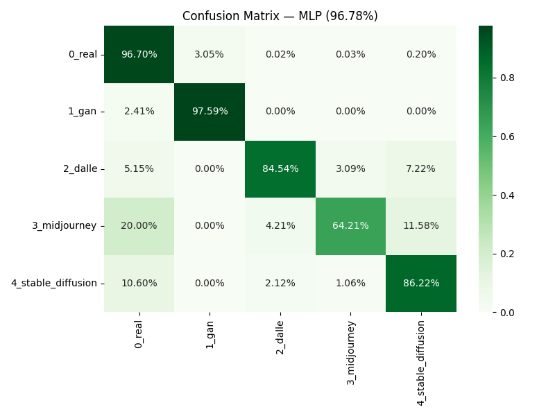
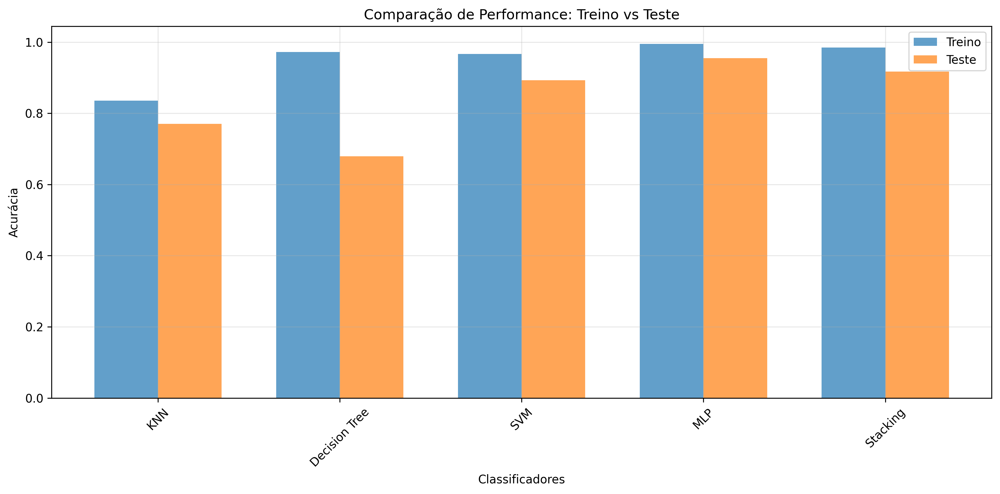

# DeepFake & AI Image Detector

[](https://huggingface.co/spaces/kalilzera/DeepFakes)

> **[🔗 Testar a Demo ao Vivo](https://huggingface.co/spaces/kalilzera/DeepFakes)** — Faça upload de uma imagem direto no navegador e descubra se ela foi gerada por IA (e por qual modelo).

Este projeto é um classificador robusto focado em **Atribuição de Fonte**. Diferente de detectores binários tradicionais ("Real ou Fake"), ele utiliza **Deep Learning** para identificar a "impressão digital" matemática de 5 categorias diferentes de autores de imagem. **Ele não diz apenas que é Fake, ele diz QUAL inteligência artificial gerou a imagem**, alcançando uma **acurácia de 96.78%**:

- 👤 **Humano (Real)** (Fotos não processadas)
- 🤖 **Deepfake Clássico (GANs)** (StyleGAN, Face Swapping)
- 🎨 **DALL-E 3** (Integração ChatGPT)
- 🌌 **Midjourney v6**
- 🖌️ **Stable Diffusion** (SDXL, SD3, SD 2.1)

<div align="center">
  
  
  <p><em>Matriz de Confusão para as 5 classes e Comparação de Desempenho dos Modelos Clássicos.</em></p>
</div>

## Arquitetura Híbrida

1.  **Extração de Características (`DenseNet121`)**: Extrai 1024 *features* ricas da imagem de entrada usando a arquitetura DenseNet (pré-treinada no ImageNet), analisando texturas e artefatos de compressão invisíveis ao olho humano.
2.  **Classificador Multi-Classe (`MLP`)**: Um Perceptron Multicamadas (512 -> 256 -> 128) mapeia essas características diretamente para as 5 classes geradoras suportadas (Probabilidades).

## Como Rodar o Projeto

### 1. Instalação Local

1.  Clone o repositório e acesse a pasta:
    ```bash
    git clone https://github.com/kalil03/DeepFakes.git
    cd DeepFakes
    ```

2.  Crie um ambiente virtual e instale as dependências:
    ```bash
    python3 -m venv venv_ia
    source venv_ia/bin/activate  # ou venv\Scripts\activate no Windows
    pip install -r requirements.txt
    ```

### 2. Interface de Demonstração (Flask)

Para subir um servidor web simples de inferência em sua própria máquina:

```bash
python3 app.py
```
Acesse **http://localhost:5000** no seu navegador, faça o upload de uma foto e veja a classificação.

### 3. Treinamento Local (Opcional)

Se desejar retreinar o modelo a partir do zero ou adicionar fotos de novas IAs (ex: Gemini):

1.  **Datasets**: O arquivo `build_multi_dataset.py` organiza arquivos provindos dos datasets [140k Real and Fake Faces](https://www.kaggle.com/datasets/xhlulu/140k-real-and-fake-faces) e [Defactify (arXiv:2601.00553v1)](https://arxiv.org/html/2601.00553v1).
2.  Rode a extração e treinamento do MLP:
    ```bash
    # (Para GPUs AMD. No caso de Nvidia, basta 'python3 train_mlp.py')
    HSA_OVERRIDE_GFX_VERSION=10.3.0 python3 train_mlp.py
    ```

## Estrutura de Arquivos

*   `app.py`: Backend Flask provendo a rota de inferência e cálculo matemático.
*   `huggingface/app.py`: Aplicação Gradio e UI Avançada para publicação no Hub Público.
*   `train_mlp.py`: Script para treinar o classificador a partir de imagens.
*   `requirements.txt`: Dependências do projeto.
*   `*.pkl`: Pesos pré-treinados atuais e modelagem lógica *(disponíveis via LFS)*.
